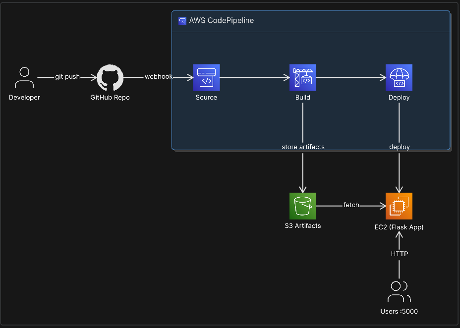
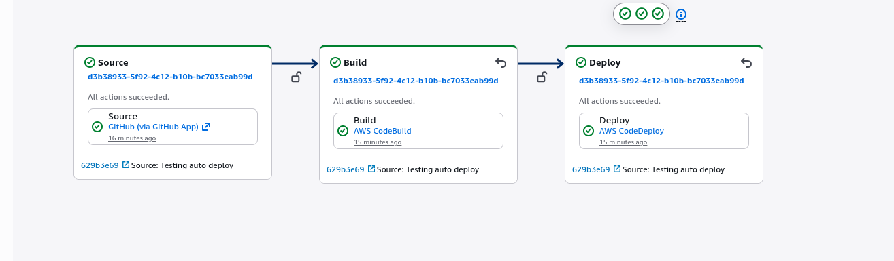
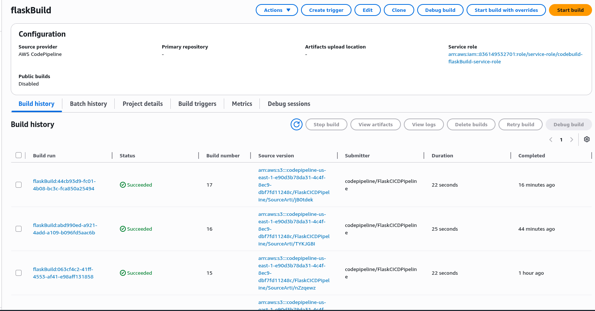
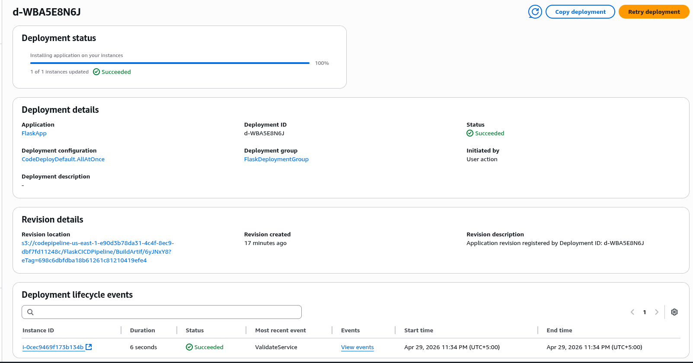
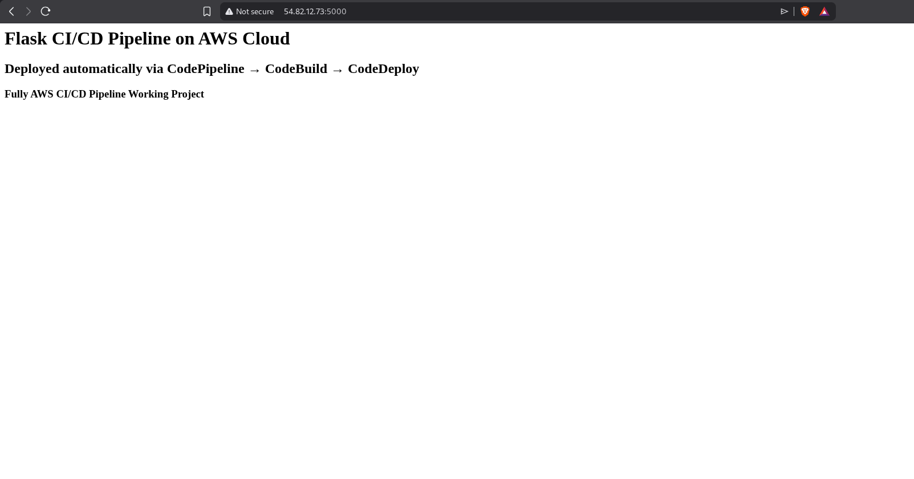

# CI/CD Pipeline for Flask App on AWS

A fully automated CI/CD pipeline built on AWS that deploys a Python Flask application to EC2 automatically on every GitHub push — no manual deployment needed.

---

## Architecture



---

## How It Works

Every time code is pushed to the GitHub repository, AWS CodePipeline automatically triggers the pipeline. CodeBuild installs dependencies and runs tests. If tests pass, CodeDeploy deploys the latest version to the EC2 instance — all without any manual intervention.

---

## AWS Services Used

| Service | Purpose |
|---|---|
| GitHub | Source code repository and pipeline trigger |
| AWS CodePipeline | Orchestrates the full CI/CD pipeline |
| AWS CodeBuild | Installs dependencies and runs pytest tests |
| AWS CodeDeploy | Deploys the Flask app to EC2 |
| Amazon EC2 | Hosts and runs the Flask application |
| Amazon S3 | Stores build artifacts between stages |
| IAM | Manages roles and permissions for each service |

---

## Project Structure

```
flask-cicd-app/
├── app.py                        # Flask application
├── requirements.txt              # Python dependencies
├── appspec.yml                   # CodeDeploy deployment config
├── buildspec.yml                 # CodeBuild build and test config
├── tests/
│   └── test_app.py               # Pytest test cases
├── scripts/
│   ├── stop_server.sh            # Stops existing Flask process
│   ├── install_dependencies.sh   # Installs pip dependencies on EC2
│   └── start_server.sh           # Starts Flask app on EC2
└── Images/
    ├── Infra.png                 # Architecture diagram
    ├── pipeline.png              # CodePipeline success
    ├── codebuild.png             # CodeBuild success
    ├── codedeploy.png            # CodeDeploy success
    └── app.png                   # Live Flask app
```

---

## Pipeline Stages

### Source
CodePipeline watches the GitHub repository. Any push to the `main` branch automatically triggers the pipeline via webhook.

### Build
CodeBuild runs the `buildspec.yml` file which:
- Installs Python 3.11
- Installs all dependencies from `requirements.txt`
- Runs pytest test suite — pipeline stops here if any test fails
- Packages the artifact and stores it in S3

### Deploy
CodeDeploy picks up the artifact from S3 and deploys to EC2 using `appspec.yml` which runs three lifecycle hooks in order:
- `stop_server.sh` — stops any running Flask process
- `install_dependencies.sh` — installs dependencies on EC2
- `start_server.sh` — starts the Flask app on port 5000

---

## How to Deploy This Yourself

### 1. EC2 Setup
- Launch an Amazon Linux 2023 EC2 instance (t2.micro)
- Open port 5000 in the security group
- Install the CodeDeploy agent:
```bash
sudo yum update -y
sudo yum install -y ruby wget
wget https://aws-codedeploy-us-east-1.s3.us-east-1.amazonaws.com/latest/install
chmod +x ./install
sudo ./install auto
sudo systemctl start codedeploy-agent
sudo systemctl enable codedeploy-agent
```

### 2. IAM Roles
Create two roles:
- **EC2-CodeDeploy-Role** — trusted entity: EC2, policies: `AmazonS3ReadOnlyAccess`, `AWSCodeDeployFullAccess`
- **CodeDeploy-Service-Role** — trusted entity: CodeDeploy, policy: `AWSCodeDeployRole`

Attach `EC2-CodeDeploy-Role` to your EC2 instance.

### 3. CodeDeploy
- Create Application: `FlaskApp` (EC2/On-premises)
- Create Deployment Group: `FlaskDeploymentGroup`
- Service role: `CodeDeploy-Service-Role`
- Tag your EC2 instance and select it in the deployment group

### 4. CodePipeline
- Source: GitHub (via GitHub App) → your repo → `main` branch
- Build: CodeBuild → create project with `buildspec.yml`
- Deploy: CodeDeploy → `FlaskApp` → `FlaskDeploymentGroup`

### 5. Access the App
```
http://YOUR_EC2_PUBLIC_IP:5000
```

---

## Screenshots

### Pipeline Success


### CodeBuild Success


### CodeDeploy Success


### Live Flask App


---

## What I Learned

- How to build an end-to-end CI/CD pipeline on AWS from scratch
- Connecting GitHub to CodePipeline using GitHub App for secure webhook integration
- Writing `buildspec.yml` to automate testing and building with CodeBuild
- Writing `appspec.yml` lifecycle hooks to control how CodeDeploy deploys to EC2
- Debugging real deployment failures — IAM permissions, path issues, missing appspec
- How artifacts flow between CodeBuild → S3 → CodeDeploy → EC2
- The value of automated testing in a pipeline — code only deploys if tests pass
