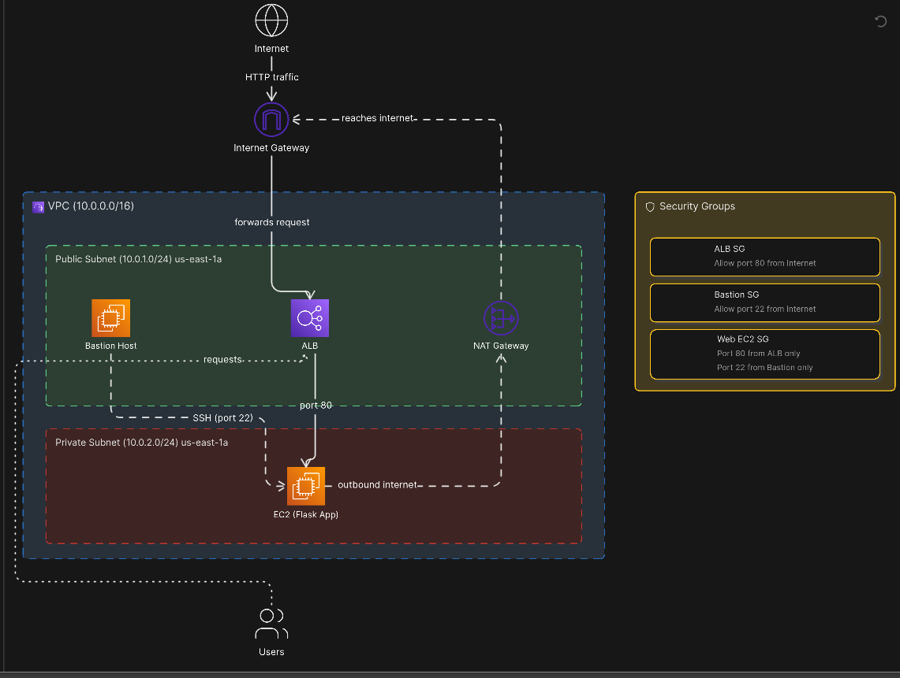
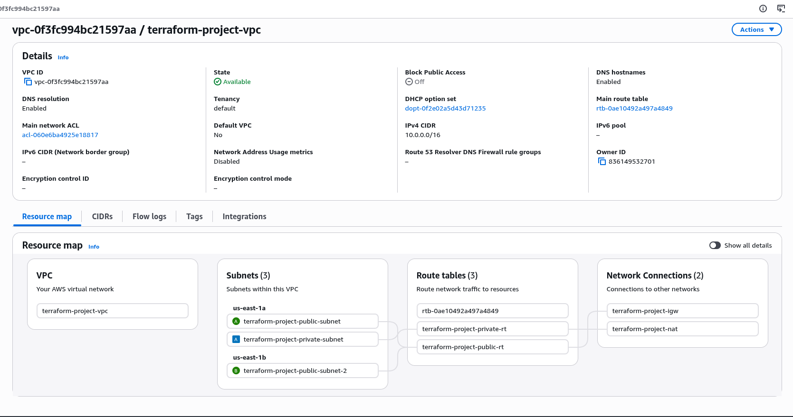
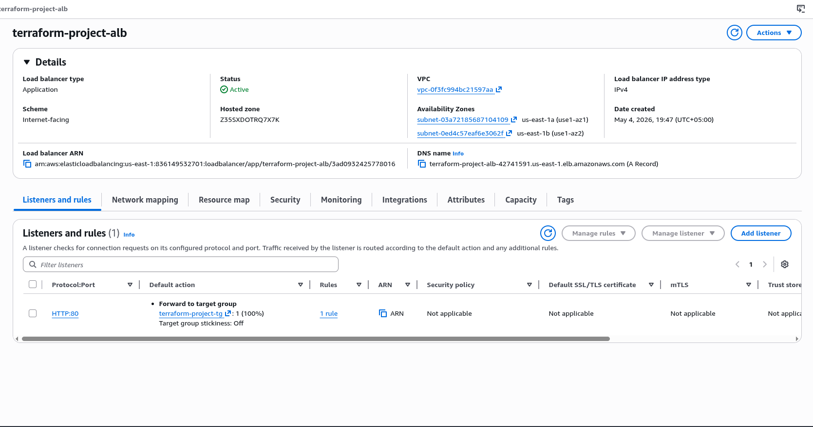
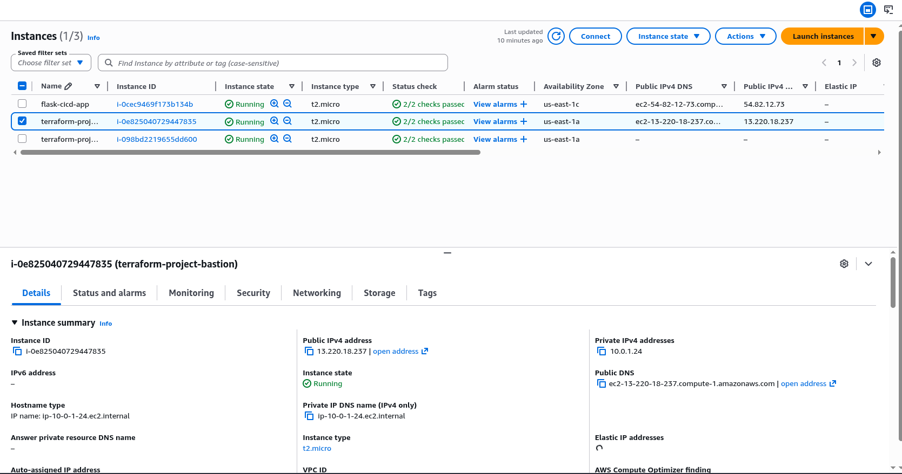
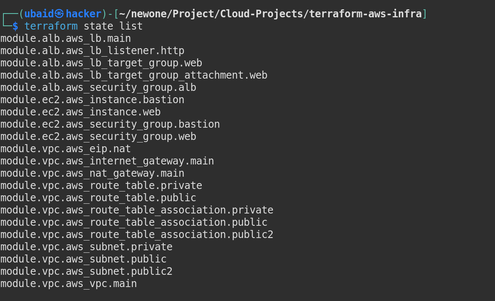
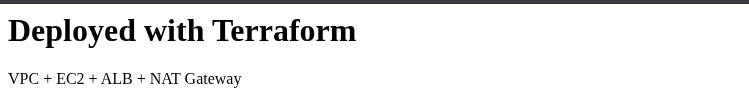

# AWS Infrastructure with Terraform (IaC)

Production-grade AWS infrastructure built entirely with Terraform — no clicking in the AWS Console. A complete VPC setup with public and private subnets, Bastion Host, NAT Gateway, EC2, and Application Load Balancer, all provisioned with a single command.

---

## Architecture



---

## What Gets Created

Running `terraform apply` creates all of this automatically:

| Resource | Count | Details |
|---|---|---|
| VPC | 1 | 10.0.0.0/16 |
| Public Subnets | 2 | us-east-1a and us-east-1b |
| Private Subnet | 1 | us-east-1a |
| Internet Gateway | 1 | Connects VPC to internet |
| NAT Gateway | 1 | Allows private EC2 to reach internet |
| Elastic IP | 1 | Static IP for NAT Gateway |
| Route Tables | 2 | Public and private routing |
| Bastion Host | 1 | EC2 in public subnet for secure SSH |
| Web EC2 | 1 | Flask app in private subnet |
| Security Groups | 3 | ALB, Bastion, Web EC2 |
| Application Load Balancer | 1 | Internet-facing, distributes traffic |
| Target Group | 1 | Registers web EC2 |

---

## AWS Services Used

| Service | Purpose |
|---|---|
| VPC | Isolated private network on AWS |
| EC2 | Bastion Host and Web App server |
| ALB | Receives internet traffic, forwards to private EC2 |
| NAT Gateway | Lets private EC2 reach internet without being exposed |
| IAM | Permissions and roles |
| Terraform | Provisions all infrastructure as code |

---

## Project Structure

```
terraform-aws-infra/
├── main.tf                  # Root module — orchestrates all modules
├── variables.tf             # Variable declarations
├── outputs.tf               # ALB DNS and Bastion IP outputs
├── terraform.tfvars         # Actual values for all variables
└── modules/
    ├── vpc/
    │   ├── main.tf          # VPC, subnets, IGW, NAT, route tables
    │   ├── variables.tf
    │   └── outputs.tf
    ├── ec2/
    │   ├── main.tf          # Bastion host, web EC2, security groups
    │   ├── variables.tf
    │   └── outputs.tf
    └── alb/
        ├── main.tf          # ALB, listener, target group
        ├── variables.tf
        └── outputs.tf
```

---

## Security Design

The infrastructure follows a secure multi-tier architecture:

**Public Subnet** — exposed to internet:
- ALB accepts HTTP traffic on port 80 from anywhere
- Bastion Host accepts SSH on port 22 from anywhere

**Private Subnet** — completely hidden from internet:
- Web EC2 only accepts port 80 from ALB security group
- Web EC2 only accepts SSH from Bastion security group
- No public IP — unreachable directly from internet
- Outbound internet access through NAT Gateway only

This means even if someone tries to attack the web server directly — they cannot. All traffic must go through the ALB.

---

## How to Deploy

### Prerequisites
- Terraform installed (`terraform version`)
- AWS CLI configured (`aws configure`)
- An EC2 Key Pair created in AWS

### Steps

**1. Clone the repo:**
```bash
git clone https://github.com/YOUR_USERNAME/Cloud-Projects.git
cd Cloud-Projects/terraform-aws-infra
```

**2. Update terraform.tfvars:**
```hcl
aws_region          = "us-east-1"
project_name        = "terraform-project"
vpc_cidr            = "10.0.0.0/16"
public_subnet_cidr  = "10.0.1.0/24"
public_subnet_cidr2 = "10.0.3.0/24"
private_subnet_cidr = "10.0.2.0/24"
az                  = "us-east-1a"
az2                 = "us-east-1b"
ami_id              = "ami-0c02fb55956c7d316"
instance_type       = "t2.micro"
key_name            = "your-key-pair-name"
```

**3. Initialize Terraform:**
```bash
terraform init
```

**4. Preview what will be created:**
```bash
terraform plan
```

**5. Deploy:**
```bash
terraform apply
```

Type `yes` when prompted. Takes 3-5 minutes — NAT Gateway takes the longest.

**6. Get the outputs:**
```bash
terraform output
```

You'll see:
```
alb_dns_name      = "terraform-project-alb-xxxxx.us-east-1.elb.amazonaws.com"
bastion_public_ip = "x.x.x.x"
```

Open the ALB DNS name in your browser — app is live. ✅

**7. Destroy when done (saves cost):**
```bash
terraform destroy
```

---

## Key Terraform Commands

```bash
terraform init        # Download AWS provider plugin
terraform plan        # Preview changes (dry run)
terraform apply       # Create all infrastructure
terraform destroy     # Tear down everything
terraform state list  # See all created resources
terraform output      # Show output values
```

---

## Screenshots

### VPC Resource Map
Shows VPC, 3 subnets across 2 AZs, 3 route tables, IGW and NAT Gateway — all created by Terraform.



### Application Load Balancer
Active ALB with HTTP:80 listener forwarding to the target group.



### EC2 Instances
Bastion Host in public subnet (with public IP) and Web EC2 in private subnet (no public IP).



### Terraform State List
All 20 resources tracked and managed by Terraform state.



### Live Web App
Flask app accessible via ALB DNS — running on a private EC2 with no public IP.



---

## What I Learned

- Writing production-grade Terraform using modules — vpc, ec2, alb separated cleanly
- Understanding VPC networking — subnets, route tables, IGW, NAT Gateway and how they connect
- Secure architecture design — private subnets, bastion host, security group chaining
- How ALB routes traffic to private EC2 instances that have no public IP
- Using `user_data` to automatically configure EC2 on launch without manual SSH
- Managing Terraform state and reading resource details with `terraform state show`
- The power of Infrastructure as Code — entire production environment created and destroyed with one command
